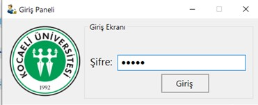
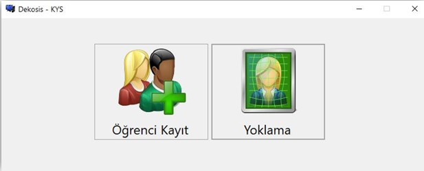
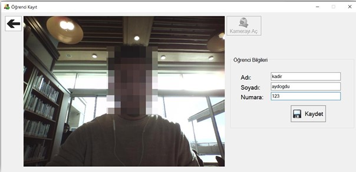
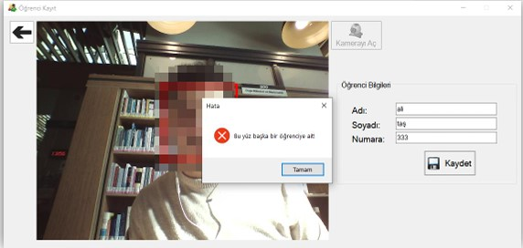
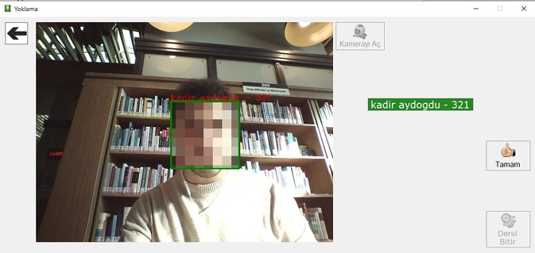
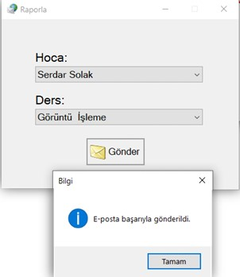

# Dekosis - KYS (Yüz Tanıma ile Yoklama Uygulaması)

Bu proje, **Emgu CV** kütüphanesi kullanılarak geliştirilmiş bir yüz tanıma ve yoklama uygulamasıdır. Uygulama, kamera ile yüz tanıma yaparak yoklama işlemini hızlı ve kolay bir şekilde gerçekleştirir.

## Özellikler

- **Yüz Tanıma**: Kameradan alınan görüntüdeki yüzleri tespit eder ve tanır (HaarCascade).
- **Yoklama Sistemi**: Tanınan yüzleri veri tabanındaki kayıtlarla karşılaştırarak yoklama alır.
- **Raporlama**: Alınan yoklamaları bir rapor dosyasına kaydeder ve mail olarak gönderir.
- **Kullanıcı Dostu Arayüz**: Basit ve anlaşılır bir kullanıcı arayüzü ile işlemleri kolaylaştırır.

## Gereksinimler

- **.NET Framework 4.7.2** veya üstü
- **Visual Studio 2022** veya üstü (isteğe bağlı geliştirme için)
- **Emgu CV Kütüphanesi**
  - `Emgu.CV`
  - `Emgu.CV.UI`
  - `Emgu.CV.Bitmap`
- Kamera (yüz tanıma işlemi için)

## Kurulum ve Çalıştırma

1. **Uygulamayı Çalıştırın**
   - `bin` klasöründe bulunan `Dekosis - KYS.exe` dosyasını çift tıklayarak çalıştırabilirsiniz.

## 🖼️ Ekran Görüntüleri

**Giriş Paneli:**

**Ana Ekran:**

**Öğrenci Kayıt**

**Kayıt Kontrol**

**Yoklama**

**Yoklama Raporu**

------------------------------------------------------------------------

## Lisans

Bu proje MIT Lisansı ile lisanslanmıştır. Daha fazla bilgi için [LICENSE](LICENSE) dosyasına bakabilirsiniz.

------------------------------------------------------------------------
